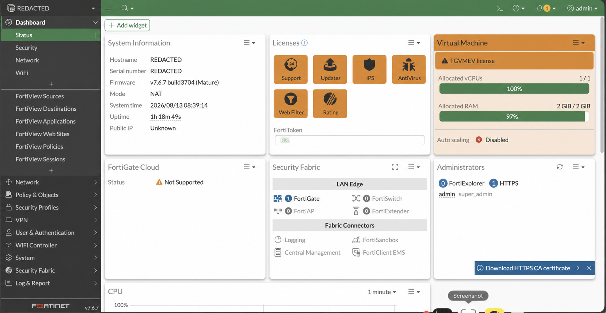

# DailyBuild — Security & Automation

A practical portfolio of network security and automation labs, centred on FortiGate administration and Python-based network operations.

> **Status:** Active learning project. This repository showcases selected work, not every practice lab.

## What this repository demonstrates

- FortiGate policy, NAT, segmentation, VPNs, and troubleshooting
- Python, Netmiko, Ansible, and Jinja2
- Inventory-driven backups and configuration changes
- Validation and compliance reporting

## Repository map

```text
.
├── fortigate/       # FortiGate lab scenarios and notes
├── automation/      # Python/Netmiko automation projects
├── diagrams/        # Network diagrams and IP plans
├── configs/         # Sanitized example configurations
└── evidence/        # Sanitized screenshots and command output
```

## Selected projects

| Area | Project | Focus |
| --- | --- | --- |
| FortiGate | Secure edge | Routing, policy, NAT, and logging |
| FortiGate | Segmented DMZ | Zones, VIPs, and controlled traffic flows |
| FortiGate | Site-to-site VPN | IPsec configuration and troubleshooting |
| Automation | Device backups | Inventory-driven collection with Netmiko |
| Automation | Compliance checks | Validation and pass/fail reporting |
| Automation | Configuration workflow | Inventory → backup → change → validate |

## Automation

The first automation stage uses Python and Netmiko to connect through the lab VPN to multiple Cisco IOSv routers in Cisco CML, then collect interface, routing, and version data.

**Workflow:** Cisco CML → VPN → Python/Netmiko → IOSv routers

[View the automation project](automation/)

## FortiGate environment

Sanitized FortiGate VM dashboard used for the firewall labs.



## Documentation approach

Only milestone projects that best demonstrate design, implementation, validation, and troubleshooting receive full write-ups. Use [LAB_TEMPLATE.md](LAB_TEMPLATE.md) for those projects.

## Security and privacy

All examples must be sanitized before they are committed. Real passwords, API keys, private keys, public IP addresses, serial numbers, customer data, and production hostnames do not belong in this repository. See [SECURITY.md](SECURITY.md).
