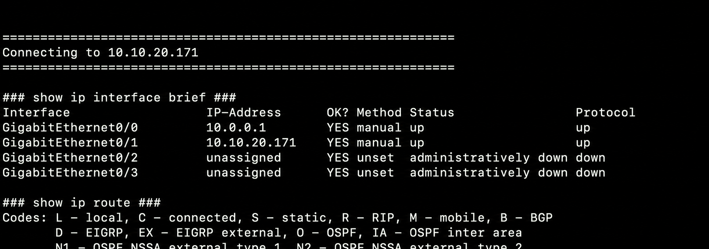

# Network automation

Python and Netmiko automation running from a local workstation, through the lab VPN, to Cisco IOSv routers in Cisco CML.

```text
Cisco CML → VPN → Python/Netmiko → IOSv routers
```

## Current stage: multi-device show commands

- Connects to multiple Cisco routers over SSH
- Runs operational commands against each device
- Collects interface, routing, and version information
- Scales by adding devices to the YAML inventory
- Reads credentials from environment variables—never source files



## Run it

```bash
cd automation
python -m venv .venv
source .venv/bin/activate
pip install -r requirements.txt
cp inventory/devices.example.yaml inventory/devices.yaml
```

Update `inventory/devices.yaml` with lab addresses, then provide credentials locally:

```bash
export NETWORK_USERNAME="your-username"
export NETWORK_PASSWORD="your-password"
python scripts/multi_device_show.py
```

`inventory/devices.yaml` is ignored by Git so lab-specific addresses stay local.

## Next stages

Configuration backups → controlled changes → validation → reporting
